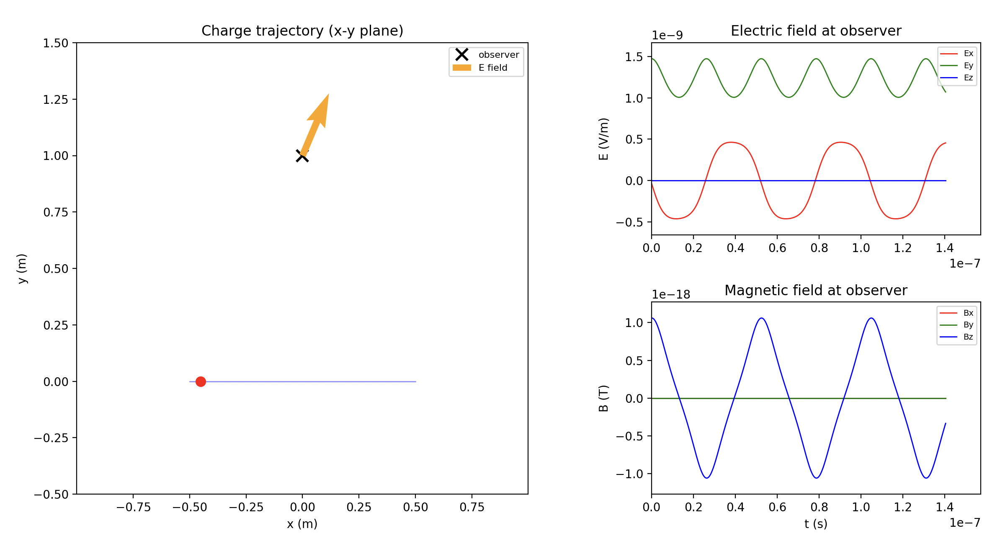

# Electrodynamics Simulator

A Python simulator that computes and visualizes electromagnetic fields generated by moving charged particles using the **Lienard-Wiechert formulas** from classical electrodynamics.


## Overview


This project solves the full relativistic electromagnetic field equations for arbitrarily moving point charges. It handles retarded-time calculations, velocity-dependent (Coulomb) and acceleration-dependent (radiation) field components, and renders real-time animations of field evolution.

## Features

- **Lienard-Wiechert field computation** with proper retarded time solving (Brent's method)
- **Relativistic support** for charges moving at significant fractions of *c*
- **Multiple trajectory models**: circular, oscillatory, and linear uniform motion
- **Real-time visualization** with three-panel animated display:
  - 2D charge trajectory with E-field vector at the observer
  - Electric field components (Ex, Ey, Ez) over time
  - Magnetic field components (Bx, By, Bz) over time
- All calculations in **SI units**

## Installation

```bash
pip install numpy scipy matplotlib
```

## Usage

Run a demo from the command line:

```bash
python main.py [demo_name]
```

Available demos:

| Demo | Description |
|------|-------------|
| `circular` | Synchrotron-like radiation from circular motion |
| `oscillating` | Dipole radiation with observer perpendicular to oscillation axis |
| `oscillating_longitudinal` | Dipole radiation with observer along oscillation axis |
| `static` | Pure Coulomb field from a stationary charge |
| `relativistic` | Lorentz-contracted fields from a charge moving at 0.9c |

Running without arguments will prompt you to select a demo interactively.

## Project Structure

```
main.py            Entry point with demo scenarios
physics.py         Field computation engine (Lienard-Wiechert formulas)
trajectories.py    Charge trajectory definitions (circular, oscillating, linear)
visualization.py   Real-time matplotlib animation
```

## Physics

The simulator computes E and B fields from:

- **Velocity (Coulomb-like) term**: accounts for the charge's retarded position and velocity
- **Acceleration (radiation) term**: produces fields that fall off as 1/R, responsible for electromagnetic radiation
- **Magnetic field**: derived as B = (n x E) / c

Retarded time is solved numerically from the light-cone condition:

```
c * (t_obs - t_ret) = |r_obs - r_source(t_ret)|
```
